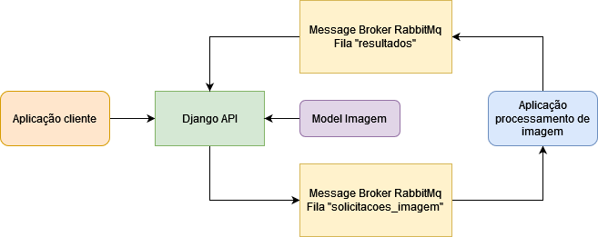

# Redimensionador-de-Imagens-Uma-Solucao-Distribuida-com-RabbitMQ
Este repositório apresenta uma solução distribuída para o redimensionamento de imagens, composta por duas aplicações: uma API Rest, baseada no Django REST framework, que envia solicitações de imagem através do RabbitMQ para uma segunda aplicação que consome as solicitações, redimensiona as imagens e retorna o resultado para a API.

# Arquitetura

  

Para o desenvolvimento desse projeto, foram criadas duas aplicações: 
A <b>aplicação API</b> é responsável por fazer a interface com aplicações clientes, onde é possivel fazer solicitações para o processamento de imagens para serem redimensionadas, essas imagens são salvas dentro da <b>aplicação API</b> na pasta /imagens/ e o caminho no model <b>Imagem</b> que podem ser visualizadas pelas aplicações clientes para confirmar se o processamento foi finalizado. 
As imagens são enviadas pela <b>aplicação API</b>, codificadas em base64, para o serviço de mensagem RabbitMq na <b>fila "solicitações_imagem"</b>, onde a <b>aplicação ImageResizer</b> consome a mensagem e realiza o processamento para redimensionar a imagem, após finalizado ela envia a imagem codificada para a <b>fila "resultados"</b>. 
Na <b>aplicação API</b>, existe um script chamado ConsumerResults.py rodando em <i>background</i> que observa se possui novos resultados para consumir na fila, se tiver, ele salva a imagem no sistema e atualiza o status de processamento para finalizado no model. 

## API

### **POST /imaging/**

#### Requisição
| Método | URL | Conteúdo-Tipo | Parâmetros |
| --- | --- | --- | --- |
| POST | /imaging/ | form-data | arquivo: imagem a ser cadastrada (.png ou .jpg) |

#### Resposta
| Código de status | Conteúdo |
| --- | --- |
| 201 (Criado) em caso de sucesso | id: ID da imagem cadastrada   arquivo: Caminho da imagem   data_upload: Data do upload da imagem   status_processamento: Status da imagem (por padrão será Pendente) |

### **GET /imaging/**

#### Requisição
| Método | URL |
| --- | --- |
| GET | /imaging/ |

#### Resposta

| Código de status | Conteúdo |
| --- | --- |
| 200 (OK) em caso de sucesso | Lista de objetos: Cada um representando uma imagem cadastrada, incluindo seus dados (ID, arquivo, data de upload e status de processamento) |

### **GET /imaging/{id}**

#### Requisição
| Método | URL |
| --- | --- |
| GET | /imaging/{id} |

#### Resposta

| Código de status | Conteúdo |
| --- | --- |
| 200 (OK) em caso de sucesso | id: ID da imagem específica   arquivo: Caminho da imagem específica   status_processamento: Status da imagem específica (Pendente/Finalizado)   data_upload: Data do upload da imagem específica |

# Testes unitários

Dentro da aplicação API, pode ser usado o comando `python manage.py test imaging` para rodar alguns testes unitários desenvolvidos, sendo eles:

- **Teste de cadastro** 
Faz o procedimento padrão para solicitar uma imagem nova para processamento, deve aumentar um elemento na base de dados e retornar o status 201.
- **Teste de cadastro com algo que não é imagem** 
Faz o procedimento para erro, tentando enviar um arquivo .txt, deve retornar o status 400.
- **Teste de busca de objeto** 
Faz o procedimento de retorno de um objeto salvo na base de dados, deve retornar status 200.
- **Teste de deleção** 
Faz o procedimnento de remoção de um objeto no banco, deve retornar status 204 e reduzir um elemento da base de dados.
- **Teste de atualização banco pós processamento** 
Faz o procedimento de confirmação se o retorno dos resultados é salvo corretamente no sistema, o objeto deve estar com o status de processamento como **Finalizado**.

# Inicialização do projeto

## Docker
Para ser inicializado o projeto, a forma recomendada é utilizar o comando `docker compose up --build` dentro do *root* do projeto para trazer os três containers DjangoAPI, rabbitmq e image_processor.

Após iniciado você pode acessar **localhost:8000** que deve abrir a interface de API padrão do Django REST framework, contudo caso prefira também é possível usar softwares como postman ou insomnia para testar as chamadas além de outras formas.

## Ambientes virtuais

Caso prefira também pode executar "na mão" os comandos para inicializar o sistema, para isso é necessário ter setado ambientes virtuais na aplicação API e na ImageResizer, lembre-se de instalar os **requirements.txt** de cada uma.

Na pasta **settings.py**, na /API/DjangoApi/ e /ImageResizer/ possivelmente será necessário mudar a variavel MESSAGE_BROKER_HOST para 'localhost'.

Após feito isso rode os seguintes comandos:

- Dentro da aplicação API  
`python manage.py runserver`  
`python manage.py runscript ConsumerResults`  
- Dentro da aplicação ImageResizer  
`python ImageConsumer.py`  

